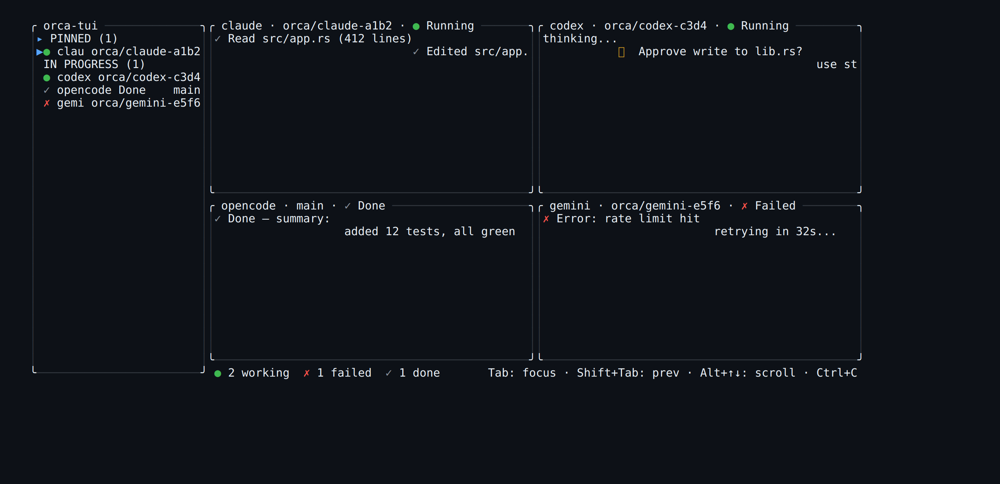

# 🐋 orcatui

**Terminal multi-agent coding orchestration.** A TUI port of
[Orca GUI](https://github.com/stablyai/orca): run N coding agents (Claude Code,
Codex, OpenCode, Gemini CLI, …) each in its own git worktree, side-by-side in
split terminal panes, monitored and steered from one screen — at
**20 agents @ 60 fps @ ≤100 ms response**.



> The screenshot above is the real rendered frame from `cargo run --example screenshot`
> (4 agents: one editing, one waiting on approval, one done, one failed) — sidebar
> panel + double-bordered panes + status footer, all theme-driven.

## Why a TUI?

Orca GUI is an Electron app. On WSL / headless / no-GPU machines that stack is
heavy and janky. A terminal draws character cells, so the GPU cost is ~0 and we
can hold 20 agents at 60 fps with a tight end-to-end budget — tmux/zellij
lightness, with an orchestration layer on top. No tmux dependency: orcatui
drives PTYs directly.

## Status

**All 10 core features implemented** · 355 tests · 71% coverage · CI green ·
opencode-inspired **box-form** UI (themed panel boxes, 3-level background
palette, 2-line sidebar entries, Pinned section, jump palette) · **full
agent-rendering compatibility** (synchronized-output mode 2026 batching +
terminal query responder + `TERM` injection, so sophisticated TUI agents like
**opencode** render instead of going blank) · **Orca daemon client** (`--daemon`
connects to a running Orca GUI for session persistence + multi-client) · powered
by [`ratatui-ppalla`](https://crates.io/crates/ratatui-ppalla) 0.0.3
(`PreparedBlock` cached borders).

| # | Feature | Status |
|---|---------|--------|
| 1 | Single-agent pane (PTY → vt100 → ratatui) | ✅ |
| 2 | Multi-pane grid layout | ✅ |
| 3 | Agent registry (detect Claude/Codex/OpenCode/Gemini/Amp/Cursor) | ✅ |
| 4 | AgentBus (tokio mpsc, N→1) | ✅ |
| 5 | FrameScheduler (60 fps throttle + frame-skip + idle backoff) | ✅ |
| 6 | WorktreeManager (git worktree per agent, `--worktree`) | ✅ |
| 7 | Coordination (sequential `plan_chain` / parallel `plan_from_spec`) | ✅ |
| 8 | SSH remote (`--remote`, `--reconnect` backoff) | ✅ |
| 9 | GitHub/Linear (`prs`/`issues` via `gh`; `orchestrate --issues`) | ✅ |
| 10 | Mobile companion (WebSocket server, `--mobile <PORT>`) | ✅ server |
| 11 | **Orca daemon client** (`--daemon`: session persistence, multi-client, auto-reconnect) | ✅ |

See [`docs/ROADMAP.md`](docs/ROADMAP.md) for the full architecture, performance
measurements, and the opencode layout study.

## Install & run

```bash
# from source
cargo run --release -- run -- claude

# run two agents side by side
orcatui run --cwd ./my-repo -- claude :: codex

# each agent in its own git worktree
orcatui run --worktree -- claude :: codex :: opencode
```

The agent invocation is captured verbatim after `--`, so flags are forwarded to
the agent: `orcatui run -- claude --dangerously-skip-permissions`.
Separate multiple agents with ` :: `.

## CLI reference

```
orcatui run [--cwd DIR] [--worktree] [--daemon] [--remote HOST] [--reconnect] [--mobile PORT] -- <agent> [:: <agent> ...]
orcatui orchestrate [--spec TEXT | --issues OWNER/NAME] [--parallel]
orcatui prs <owner/name>
orcatui issues <owner/name>
orcatui mobile [--port PORT]
orcatui --version
```

### Key bindings (detailed)

orcatui uses **zellij-style modes**. The one key to remember:
**`Ctrl+P` is the gateway to controlling orcatui.** In the default mode every
other key is sent straight to the focused agent — press `Ctrl+P` first to drive
orcatui itself.

#### Global — work in any mode

| Key | Action |
|-----|--------|
| `Ctrl+P` | Enter **Pane mode** (control orcatui: focus, pin, …) |
| `Ctrl+Q` | Quit orcatui |
| `Ctrl+N` | **Spawn a new agent pane** (auto-picks an installed agent — claude / codex / opencode / …) |
| `Ctrl+B` | **Toggle the sidebar** (adaptive: auto-hides on narrow terminals; force show/hide at any width) |
| Mouse scroll | Scroll the focused pane's scrollback (1000 lines, 3 lines/notch) |

#### Normal mode (default) — passthrough

Every key — `Tab`, `Esc`, `Ctrl+C`, arrows, all typing — is forwarded to the
focused agent's PTY exactly as if it were a real terminal. This is how you talk
to the agent. To control orcatui, enter Pane mode with `Ctrl+P`.

#### Pane mode (`Ctrl+P`) — navigation & control

| Key | Action |
|-----|--------|
| `←` `↑` `↓` `→`  or  `h` `j` `k` `l` | Move focus (grid-aware: stays within the row/column) |
| `Tab` / `Shift+Tab` | Focus next / previous pane (wraps) |
| `p` | **Pin / unpin** the focused agent → sidebar "PINNED" section |
| `/` | **Jump palette** — fuzzy-focus any agent (type to filter, Enter to focus) |
| `Esc` | Return to Normal (passthrough) |

#### Jump mode (`/` from Pane mode) — fuzzy-focus

| Key | Action |
|-----|--------|
| *(type)* | Filter agents by name (case-insensitive substring) |
| `↑` / `↓` | Select previous / next match |
| `Enter` | **Focus** the selected agent and return to Normal |
| `Esc` | Cancel and return to Pane mode |

> The sidebar auto-scrolls to keep the focused agent visible. The footer always
> shows the current mode's hints in accent color, plus a live tally:
> `● N working · ✗ N failed · ✓ N done`.

## Configuration

Zero-config by default — everything has a built-in. Override via
`~/.config/orcatui/config.toml` (or `$XDG_CONFIG_HOME`):

```toml
default_agent = "claude"

[layout]
sidebar_width = 26          # 0 hides the sidebar
show_status_bar = true

[theme]
background = "#0d1117"      # root background
foreground = "#e6edf3"
accent   = "#58a6ff"
success  = "#3fb950"
warning  = "#d29922"
error    = "#f85149"
# opencode-style box-form tokens (optional; default to GitHub-dark)
background_panel   = "#161b22"   # raised panel/box bg (sidebar, footer)
background_element = "#21262d"   # further-raised (hover, nested)
border       = "#30363d"         # box border color
border_active = "#58a6ff"        # focused box border
text_muted  = "#8b949e"          # secondary text

[daemon]
reconnect_initial_secs = 3       # first retry delay (s)
reconnect_max_secs = 30          # backoff cap (s)
reconnect_max_attempts = 0       # 0 = unlimited
rpc_timeout_secs = 10            # RPC timeout (s)
hello_timeout_secs = 5           # handshake timeout (s)
```

## How it works

```
                    ┌── --daemon? ──┐
                    │               │
              Yes   │          No   ▼
                    ▼         [Standalone: portable-pty]
         [Orca Daemon]         │  PTY byte stream
         (Unix socket)         │
              │               │
              ▼               ▼
    [DaemonClient RPC]  [QueryResponder]  answer OSC color / DECRQM / DA / DCS probes
    createOrAttach ──────────────┐
    write / resize / kill        │
              │                  ▼
    [Stream Reader]      [OscScanner]    intercept OSC 9999 → AgentActivity
    (Data/Event frames)        │
              │                ▼
              └──────→ [SyncScanner]     buffer mode-2026 batches, flush atomically
                              │
                              ▼
                     [vt100]           ANSI parse → styled cell grid
                      │
                      ▼
                     [AgentBus]        tokio mpsc, N→1, batch-drained per frame
                      ▼
                     [FrameScheduler]  16 ms budget, skip on backlog, idle backoff
                      ▼
                     [App::render]     sidebar (● Standalone/● Daemon/✗ Disconnected)
                                      │ pane grid (PreparedBlock + cursor)
                                      │ footer status bar
                                      │ toast overlay (daemon errors)
                      ▼
                     [crossterm]        → stdout
```

## Agent rendering compatibility

A naive PTY + vt100 embedder shows **blank/flickering panes** for sophisticated
TUI agents (opencode/OpenTUI, and others). orcatui handles the three things they
need:

1. **`TERM` injection** — each child PTY is told `TERM=xterm-256color` +
   `COLORTERM=truecolor`, so the agent emits sequences the vt100 emulator
   understands (a multiplexer must declare what it emulates, like tmux).
2. **Query responder** (`query.rs`) — agents probe capabilities (default fg/bg
   color via OSC 10/11, mode support via DECRQM, device attributes, terminfo via
   DCS) and **wait for replies**. orcatui synthesizes them so the agent
   proceeds.
3. **Synchronized output** (`sync.rs`) — agents that redraw inside a mode-2026
   batch (`ESC[?2026h … clear+draw … ESC[?2026l`) get the batch **buffered and
   flushed atomically**, so orcatui never renders the intermediate *cleared*
   frame (the "blank pane" symptom). This is general — it fixes any agent using
   synchronized output, not just opencode.

> Debugging these is deterministic via the `orcatui-inject` tool (below): record an
> agent's raw PTY bytes, replay them through the emulator at a chosen size, and
> snapshot the frame — no live terminal needed.

## Debug tool: `orcatui-inject`

A companion CLI (built alongside `orcatui`) for reproducing agent-rendering
issues deterministically — no live terminal, no flakiness:

```bash
orcatui-inject record [--for-secs 8] [--size 80x24] [--resize WxH@secs] --out rec.bin -- opencode
orcatui-inject replay  rec.bin [--size 51x21] [--resize WxH@chunk] [--chunk N] [--render]
```

- **`record`** spawns a real agent in a PTY and saves its raw output bytes
  (`--resize` reproduces orcatui's spawn-then-resize by resizing the PTY
  mid-recording).
- **`replay`** feeds those bytes through the emulator + query responder + sync
  batcher at a chosen size (optionally simulating a mid-stream resize) and dumps
  the resulting frame. `--render` draws a real pane (border + theme) like the
  user sees.

This is how the opencode blank-pane bug was isolated: it proved the vt100
emulator, alt-screen, size, resize, and query responder were all fine, and
pinned the cause on mode-2026 synchronized output. Set `ORCA_DEBUG_LOG=1` on
`orcatui` itself to log per-chunk byte/cell counts and resize events to
`/tmp/orca-live.log`.

## Relationship to ratatui-ppalla

[`ratatui-ppalla`](https://crates.io/crates/ratatui-ppalla) is a standalone,
high-performance TUI library built on ratatui. It implements the *Preparable
pattern* (`prepare` once / `layout` every frame) which splits expensive
one-time work from cheap per-frame work.

orcatui consumes **ppalla v0.0.3 from crates.io** and uses it where it earns
its keep:

- **`PreparedBlock`** — pane borders use a cached glyph placement (keyed on
  dimensions + title, *not* on the focus color, so toggling focus is free).
- ~~`PreparedBuffer`~~ — tried for dirty-only cell repaint, but it is
  **incompatible with ratatui's double-buffered `Terminal`** (the back buffer
  swaps each `flush`, so unrepainted cells carry 2-frame-old content and the diff
  smears the screen). Reverted to a correct full-grid repaint each frame;
  ratatui's own stdout diff still skips unchanged cells.

Orca-specific logic (AgentBus, PTY management, terminal emulation, worktrees,
coordination, sync-output batching, query responder) lives only in this repo;
ppalla never depends on Orca.

## Tech stack

| Area | Crate | Purpose |
|------|-------|---------|
| TUI rendering | `ratatui` + `ratatui-ppalla` 0.0.3 | widgets, Preparable pattern (`PreparedBlock` cached borders) |
| Terminal backend | `crossterm` 0.28 | raw mode, alt screen, events |
| PTY management | `portable-pty` 0.9 | spawn agent processes |
| Terminal emulation | `vt100` 0.15 | ANSI parse → Cell grid + diff |
| Async runtime | `tokio` (full) | AgentBus MPSC, timers |
| CLI | `clap` 4 (derive) | argument parsing |
| Config | `serde` + `toml` | settings |
| WebSocket | `tokio-tungstenite` | mobile companion server |
| Errors | `anyhow` | ergonomics |

> `vt100` is pinned to 0.15 (not 0.16): ratatui 0.29 (forced by ppalla) exact-pins
> `unicode-width =0.2.0`, while every `vt100 0.16.x` requires `^0.2.1`. Bump once
> ratatui relaxes the pin.

## Performance (measured, release build)

| Hot path | Result | % of 16.67 ms budget |
|----------|--------|----------------------|
| 1-pane render | **330 µs** | 2.0% |
| 5-pane render | **818 µs** | 4.9% |
| 10-pane render | **1.25 ms** | 7.5% |
| 20-pane render | **2.16 ms** | 13.0% |

> 20-pane render at 13% of budget → **60 fps for N=20 with 87% headroom**.

## License

MIT OR Apache-2.0.
